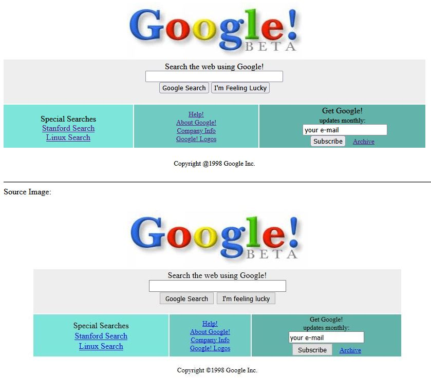

# HTML/CSS Practice Project

This project is designed to help you practice your HTML and CSS skills by recreating a webpage based on a provided screenshot.

# Getting Started

Open up any of the test.html files in a browser to view the implementation, compared to the original screenshot

[Open test1.html](src/test1.html)

Example test:
